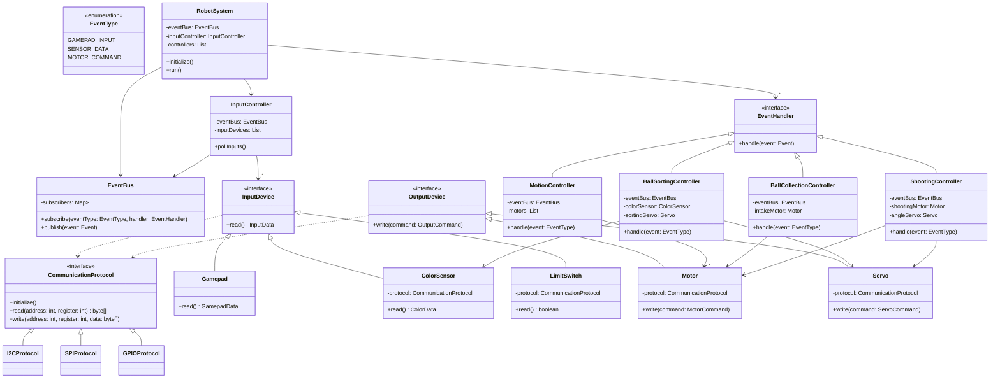

# Project System Design

This project is designed to create a modular robotic system with distinct components for input, output, control, and communication, utilizing an event-driven architecture. Below is an in-depth description of the system design.

## Overview

The system is composed of several packages, each responsible for a different aspect of the robot's functionality:

1. **Core**: Manages the communication protocols and event handling.
2. **Devices**: Includes input and output devices.
3. **Controllers**: Contains various controllers to manage different robot functions.
4. **System**: Integrates all components and runs the robot.

```plaintext
│   README.md
│   UMLDiagram.txt
│
└───pseudo
    │   main.py
    │
    ├───controller
    │       ball_collection.py
    │       ball_shooting.py
    │       ball_sorting.py
    │       input_controller.py
    │       motion_controller.py
    │       __init__.py
    │
    ├───core
    │   ├───com
    │   │       com_protocol.py
    │   │       gpio.py
    │   │       i2c.py
    │   │       spi.py
    │   │       __init__.py
    │   │
    │   └───event
    │           bus.py
    │           event.py
    │           event_t.py
    │           __init__.py
    │
    └───devices
        │   __init__.py
        │
        ├───input
        │       color_sensor.py
        │       gamepad.py
        │       input_device.py
        │       limit_sw.py
        │       __init__.py
        │
        └───output
                motor.py
                output_device.py
                servo.py
                __init__.py
```

## Detailed Design



### Core Package

#### Event

1. **EventBus**

    - **Description**: Central hub for event management, handling subscription and publication of events.
    - **Attributes**:
        - `subscribers`: A map of `EventType` to a list of `EventHandler` instances.
    - **Methods**:
        - `subscribe(eventType: EventType, handler: EventHandler)`: Registers an event handler for a specific event type.
        - `publish(event: Event)`: Publishes an event to all subscribed handlers.

2. **EventType**

    - **Description**: Enum defining different types of events.
    - **Values**: `GAMEPAD_INPUT`, `SENSOR_DATA`, `MOTOR_COMMAND`, etc.

3. **EventHandler**
    - **Description**: Interface for handling events.
    - **Methods**:
        - `handle(event: Event)`: Handles the event.

#### Communication

1. **CommunicationProtocol**

    - **Description**: Interface for different communication protocols.
    - **Methods**:
        - `initialize()`: Initializes the protocol.
        - `read(address: int, register: int): byte[]`: Reads data from a device.
        - `write(address: int, register: int, data: byte[])`: Writes data to a device.

2. **I2CProtocol, SPIProtocol, GPIOProtocol**
    - **Description**: Implementations of the `CommunicationProtocol` interface for I2C, SPI, and GPIO.

### Devices Package

#### Input

1. **InputDevice**

    - **Description**: Interface for input devices.
    - **Methods**:
        - `read(): InputData`: Reads data from the input device.

2. **Gamepad, ColorSensor, LimitSwitch**
    - **Description**: Implementations of the `InputDevice` interface.
    - **Attributes**:
        - `protocol`: The communication protocol used by the device.
    - **Methods**:
        - `read()`: Reads specific data from the device (e.g., `GamepadData`, `ColorData`, `boolean`).

#### Output

1. **OutputDevice**

    - **Description**: Interface for output devices.
    - **Methods**:
        - `write(command: OutputCommand)`: Writes a command to the output device.

2. **Motor, Servo**
    - **Description**: Implementations of the `OutputDevice` interface.
    - **Attributes**:
        - `protocol`: The communication protocol used by the device.
    - **Methods**:
        - `write(command: MotorCommand/ServoCommand)`: Writes specific commands to the device.

### Controllers Package

1. **InputController**

    - **Description**: Manages input devices and polls them for data.
    - **Attributes**:
        - `eventBus`: The event bus for publishing events.
        - `inputDevices`: A list of input devices.
    - **Methods**:
        - `pollInputs()`: Polls all input devices and publishes events.

2. **MotionController, BallCollectionController, BallSortingController, ShootingController**
    - **Description**: Handle specific events and control corresponding devices.
    - **Attributes**:
        - `eventBus`: The event bus for subscribing to events.
        - `motors`: A list of motors (specific to `MotionController`).
        - `intakeMotor`: The motor for intake (specific to `BallCollectionController`).
        - `colorSensor`, `sortingServo`: Devices for sorting (specific to `BallSortingController`).
        - `shootingMotor`, `angleServo`: Devices for shooting (specific to `ShootingController`).
    - **Methods**:
        - `handle(event: EventType)`: Handles the event and controls the devices accordingly.

### System Package

1. **RobotSystem**
    - **Description**: The main class that integrates all components and runs the robot.
    - **Attributes**:
        - `eventBus`: The central event bus.
        - `inputController`: The input controller.
        - `controllers`: A list of event handlers (controllers).
    - **Methods**:
        - `initialize()`: Initializes the system.
        - `run()`: Runs the system, typically in a loop, polling inputs and handling events.

## UML Diagram

The UML diagram included in `UMLDiagram.txt` provides a visual representation of the classes and their relationships. It is structured into packages: Core, Devices, Controllers, and System, detailing the interaction between various components.

## Conclusion

This project design ensures a modular and scalable robotic system, allowing for easy addition and modification of components. The use of an event-driven architecture enhances the system's flexibility and responsiveness, making it suitable for complex robotic applications.
